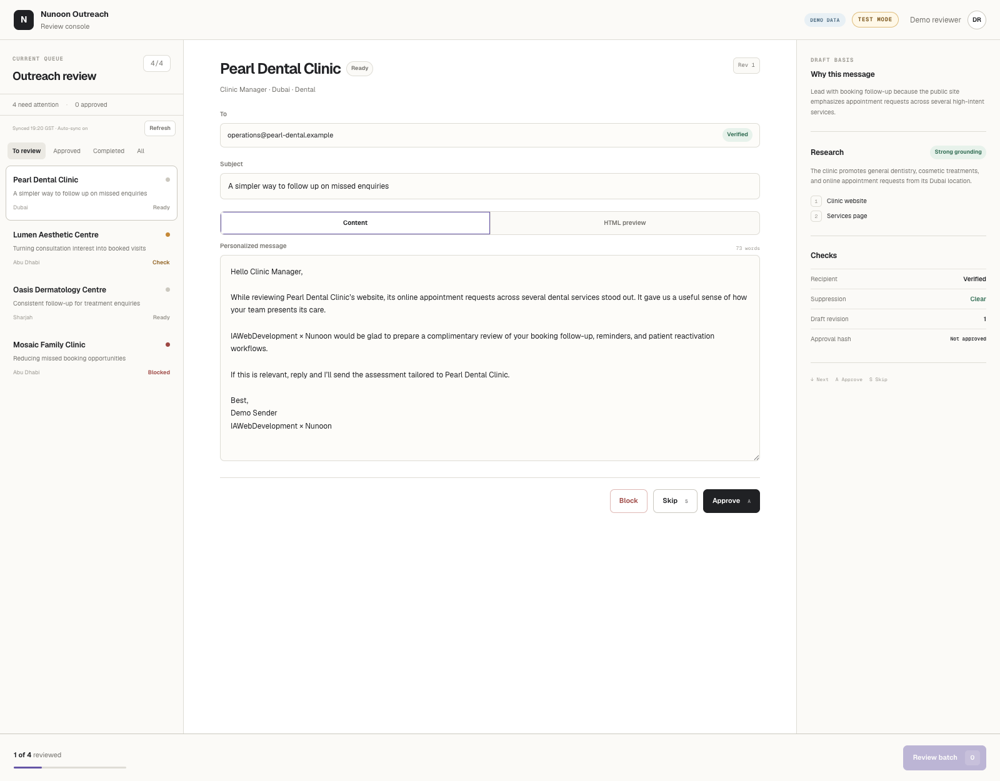
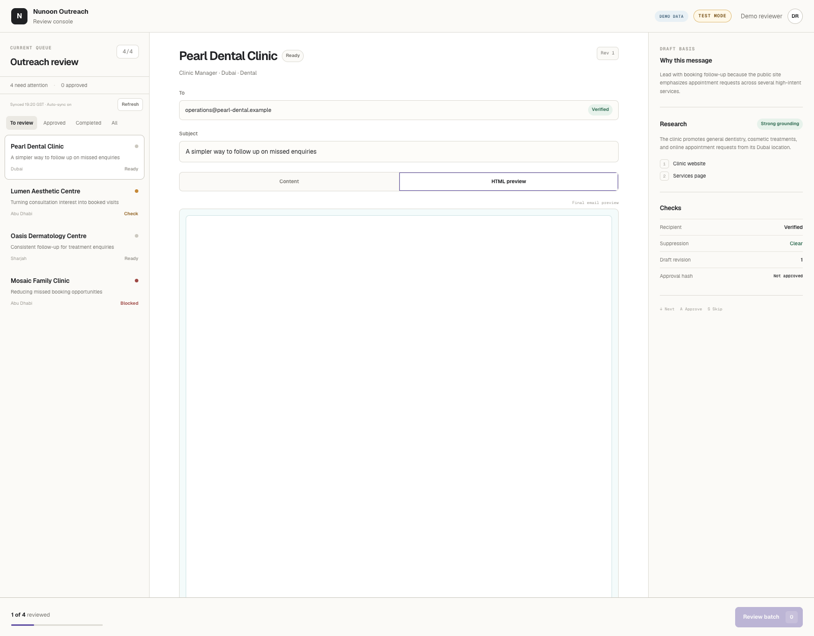
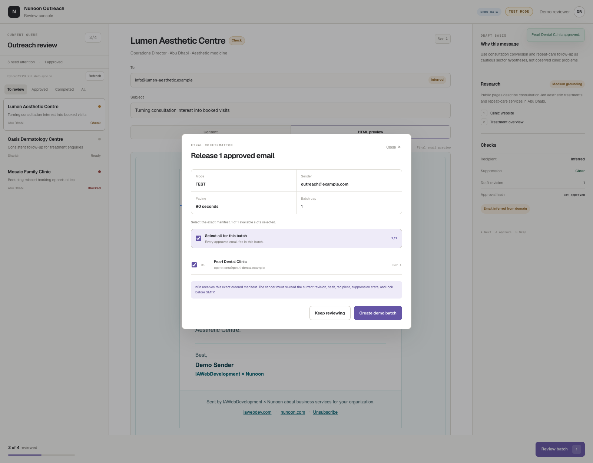

# Client Outreach System

A clinic outreach workflow that researches a business, prepares a personalized email, and puts a human reviewer in control before anything can be sent.

Built by **Asad Sayeed** for IAWebDevelopment × Nunoon.

## What it does

1. Researches clinic websites and validates the evidence.
2. Creates a plain-text draft from the validated research.
3. Lets a reviewer inspect sources, edit the draft, preview the email, and approve, skip, or block it.
4. Records the exact approved revision in a confirmed batch.
5. Uses a separate n8n sender to check that approval, content, recipient, and suppression rules still match before SMTP.
6. Handles replies, bounces, and unsubscribe requests through separate workflows.

**The dashboard does not send email.** The local demo uses fictional clinics and stores changes in memory. It needs no API keys and never contacts n8n.

## Screenshots

These are screenshots of the real frontend running locally in **DEMO DATA / TEST MODE**. Clinic names, recipients, research, and sender identity are demo fixtures.

### Review queue and draft editor



### Email preview



### Batch confirmation



## Run the demo

Requires **Node.js 22.13 or newer** and npm.

```bash
git clone https://github.com/asdsyd/client-outreach-system.git
cd client-outreach-system/review-console
npm ci
cp .env.example .dev.vars
npm run dev
```

Open the local URL printed by the server, usually `http://localhost:5173`.

The example configuration enables demo mode and TEST mode. You can edit and approve drafts and create a demo batch. Changes reset when the server restarts; no email is sent.

## How it works

```text
Clinic website -> Research -> Validated draft -> Review dashboard
                                                    |
                                              Human approval
                                                    |
                                             Confirmed batch
                                                    |
                                             n8n send checks
                                                    |
                                                  SMTP

Replies / bounces / unsubscribe -> Contact controls -> Future send checks
```

- **Approval follows the content.** Editing creates a new revision and clears the old approval.
- **Confirmed content is frozen.** Live batches include SHA-256 hashes of the exact HTML and plain-text email snapshots.
- **Send checks fail closed.** The sender rejects mismatched manifests, changed recipients, stale approvals, and invalid configuration.
- **Suppression is checked again before SMTP.** A newly blocked contact cannot rely on an earlier approval.
- **Uncertain delivery needs reconciliation.** A response without an authoritative provider message ID is not automatically retried.
- **Email HTML is deterministic.** A fixed template safely escapes plain-text copy; AI does not generate the HTML.

## Stack

| Part | Technology |
| --- | --- |
| Frontend | React 19, TypeScript, Next.js App Router conventions |
| Runtime and build | vinext, Vite, Cloudflare Workers |
| Workflow automation | n8n Code nodes and Data Tables |
| Research integration | Groq; website normalization and evidence validation |
| Email transport | SMTP in the separate n8n sender |
| Verification | Node.js tests, ESLint, workflow graph and sender release checks |

## Browse the code

| Folder or file | Purpose |
| --- | --- |
| [`review-console/`](review-console) | Dashboard, API routes, demo store, and live n8n adapter |
| [`workflows/v3/`](workflows/v3) | Research, approval, sender, inbound, and unsubscribe logic |
| [`workflows/examples/sender-v3.workflow.json`](workflows/examples/sender-v3.workflow.json) | Generated inactive n8n sender with placeholder configuration |
| [`docs/architecture.md`](docs/architecture.md) | Data flow and implementation boundaries |
| [`docs/validation.md`](docs/validation.md) | Checks run on this public copy |
| [`repairs/`](repairs) | Earlier guards and fixes reused by the workflow generators |

## Checks

```bash
# From the repository root: offline sender release gate
node workflows/v3/check-sender-release.mjs

# Frontend build, regression tests, and lint
cd review-console
npm test
npm run lint
```

The offline sender check generates and validates the workflow without sending mail or calling the live n8n instance.

## Public copy and live deployment

This repository is a sanitized source snapshot. It excludes private environment files, production deployment records, workflow backups, browser sessions, and real clinic contact fixtures. Deployment and credential identifiers are placeholders.

The local demo is ready to run. A live deployment requires your own n8n tables, credentials, mailbox configuration, and a trusted authentication gateway. The existing live adapter expects identity headers supplied by the ChatGPT Sites gateway; a deployment elsewhere needs equivalent verified authentication. Never accept those headers directly from an untrusted browser.

The generated sender example is **inactive** and needs configuration before use. This repository does not claim to provision a production instance or document its current operational state.
